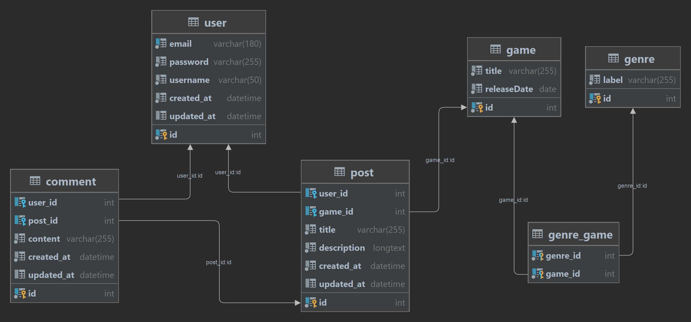

# Game Forum

  - ## Installation

    - ### Start the docker environment

      `docker-compose up -d`

      Link to the project : http://localhost

      Link to the PHPMyAdmin : https://localhost:8080

    - ### Install the composer packages

      `docker exec -it nfe-114-php bash -c 'composer install'`

    - ### Create the database

      `docker exec -it nfe-114-mysql mysql -u root -proot -e "CREATE DATABASE db_project;"`

    - ### Load the database schema

      `docker exec -it nfe-114-php bash -c './vendor/bin/doctrine orm:schema-tool:update --force'`

    - ### Load the data fixtures

      `docker exec -it nfe-114-php bash -c 'php loadDataFixtures.php'`

    - ### (Optional) Access the PHP container's bash in a terminal

      `docker exec -it nfe-114-php bash`

  - ## Description

    The goal of this project is to create an MVC type PHP application without frameworks.

    To do that I have decided to remake [the first Symfony project I did](https://github.com/Leon-guerineau/projet-symfony) which has a lot of features I could reuse.

    I also used [this project](https://github.com/ld-web/studi-mvc) as a base because features like Doctrine, Twig and many others were already setup

    - ### Modals

      For the modals I used doctrine and used the sames Entities as the symfony projects with some tweaking

      

    - ### Views

      The views were managed using Twig and all templates were taken from the symfony 

    - ### controllers

      The routes for the controller functions are managed with the Route class of the symfony-framework-bundle package so that they can be more easily accessed.

      ```PHP
      // index.php 
      
      $autoload = require __DIR__ . '/../vendor/autoload.php';
      
      // Register the Composer autoloader with the AnnotationRegistry
      AnnotationRegistry::registerLoader([$autoload, 'loadClass']);
      
      // Create a new AnnotationDirectoryLoader to load routes from annotations
      $autoload = new AnnotationDirectoryLoader(
          new FileLocator(__DIR__ . '/../src/Controller/'),
          new AnnotatedRouteControllerLoader(
              new AnnotationReader()
          )
      );
      
      // Load routes from annotated controllers
      $routes = $autoload->load(__DIR__ . '/../src/Controller/');
      
      // Initialize the RequestContext object
      $context = RequestContext::fromUri($_SERVER['REQUEST_URI']);
      $context->fromRequest(Request::createFromGlobals());
      
      // Create a UrlMatcher to match the current request against the loaded routes
      $matcher = new UrlMatcher($routes, $context);
      ```

  - ## Missing features

    Some features couldn't be implemented due to a lack of time, mainly :

    - The picture management
    - The account management and authorizations
    - The forms

    But you can see those features in action by launching the symfony version of the project